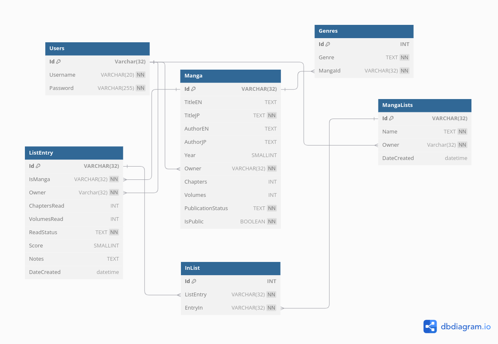

# Manga Tracker API

Simple API for my [Manga Tracker](https://github.com/nokotan8/manga-tracker), built with ExpressJS and MySQL. Includes tables for storing general and user-specific information information about manga including reading progress and custom 'reading lists'.

> [!IMPORTANT]
> This project is 1. for fun and 2. a work in progress. Do not be surprised if something breaks.

## Usage

1. Clone this repo:

```bash
git clone --depth 1 https://github.com/nokotan8/manga-tracker-api
```

2. Set up and run a MySQL database, following the instructions specific to your operating system. Create a `.env` file and populate it with the required environment variables, which are described in `.env.example`.
1. Initialise the database with:

```bash
mysql db_name < database/init_db.sql
```

4. Install dependencies and start the server at `localhost:9292`:

```bash
npm install
npm run dev
```

- Optionally, you can change the port by editing `src/index.ts`.

## Schema


The SQL file for initialising the database can also be found [here](/database/db_init.sql)

## Routes

Follow the setup instructions above and navigate to `/docs` to view the Swagger documentation for the routes.

> [!Important]
> Most routes are yet to be documented
